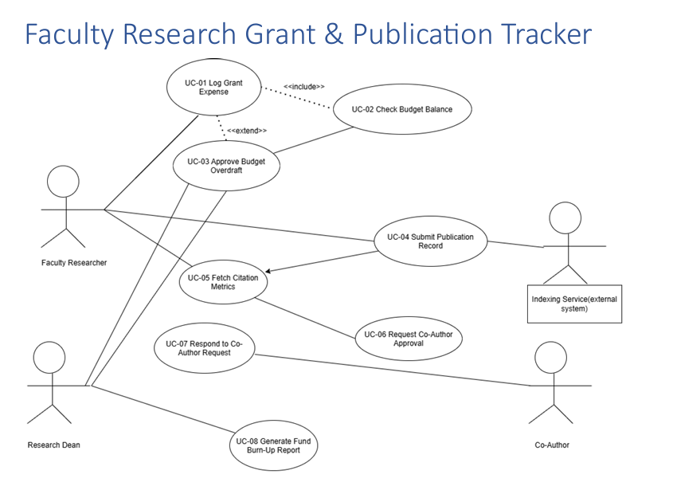

# SE Labs — Faculty Research Grant & Publication Tracker

**PES1UG24CS497**

This repo holds my Lab 1 submission for Software Engineering — requirements gathering and a UML use-case diagram for a system I designed called the **Faculty Research Grant & Publication Tracker**.

## What the system is about

The idea is a tool that helps a university research department keep grant spending and publication tracking in one place. Right now these two things (money and papers) usually live in separate spreadsheets that nobody cross-checks, which is exactly how budgets get overspent and citation counts go stale. This system ties them together:

- Faculty log expenses against their grant and the system checks the balance automatically.
- If an expense would blow past the grant cap, it gets held for the Research Dean to approve instead of just going through.
- When a faculty member submits a publication (title, journal, DOI), the system pulls citation and indexing data from an external Indexing Service instead of that being typed in by hand.
- Publications with multiple authors need every co-author to accept before the record counts as "Approved" — a single rejection kills it.
- The Dean can pull a fund burn-up report for a grant over a date range to see spend vs. allocation.

## Files in this repo

| File | What it is |
|---|---|
| `Requirements_Table_PES1UG24CS497.xlsx` | The requirements table — 5 functional requirements and 2 non-functional ones, each with an ID, priority, acceptance criteria, and rationale |
| `UML_UseCase.png` | PNG export of the use-case diagram, shown below |
| `UML_UseCase_PES1UG24CS497.pdf` | The use-case diagram (hand-drawn/formatted version) |
| `UseCase_Flow_PES1UG24CS497.pdf` | The same diagram, redone in draw.io for a cleaner export |

## Actors

- **Faculty Researcher** — logs expenses, submits publications, requests co-author approval
- **Research Dean** — approves budget overdrafts, pulls burn-up reports
- **Co-Author** — responds to approval requests
- **Indexing Service** — external system, feeds citation/indexing data into the publication flow

## Use case diagram

## Use cases

| ID | Use Case |
|---|---|
| UC-01 | Log Grant Expense |
| UC-02 | Check Budget Balance |
| UC-03 | Approve Budget Overdraft |
| UC-04 | Submit Publication Record |
| UC-05 | Fetch Citation Metrics |
| UC-06 | Request Co-Author Approval |
| UC-07 | Respond to Co-Author Request |
| UC-08 | Generate Fund Burn-up Report |

Two relationships worth calling out since they're easy to miss just glancing at the diagram:

- **UC-01 «includes» UC-02** — every expense log always triggers a balance check, no exceptions.
- **UC-03 «extends» UC-01** — the Dean approval step only kicks in *if* the expense goes over the cap. It's conditional, not part of the main flow.
- **UC-04 «includes» UC-05** — submitting a publication always pulls citation metrics from the Indexing Service in the same flow.

## Requirements summary

Five functional requirements (FR-001 to FR-005) cover expense tracking, publication submission with citation fetch, co-author approvals, Dean approval for overdrafts, and burn-up reporting. Two non-functional requirements (NFR-001, NFR-002) cover audit-log immutability and dashboard load time (under 3 seconds for up to 20 active grants). Full details, acceptance criteria, and rationale are in the xlsx.

## Notes

This was built as a lab exercise, so it's requirements + diagram only — no actual implementation yet. If later labs build on this (design docs, code, etc.) I'll add them here as separate folders.
